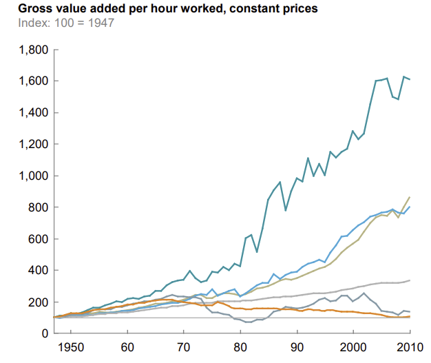

The age old addage that the poor carpenter blames his tools holds true even in the modern era. While many developers are stuck complaining about why X language lacks Y features, few are actually up to date on the language. If you asked them about one new feature introduced in their favorite version, they might not even know. 

The carpenter metaphor goes a bit further as well. You might assume that the ancient master carpenter would have much lower productivity than the modern one. How could they not? After all the modern craftsman with all their mighty inventions; rotating saw, electric powered drill, and chemical treatments, has access to tools that could complete a project before our erstwhile artisan has even stripped a log. To some extent this is true, a lumber mill does what rough carpenters need hours to do in minutes, at a fraction the cost. Of course this isn't exactly "construction" of anything, it's more like material processing/refining. To actually build something isn't easy.

In fact, here in the USA we've been getting worse at it. Look at this chart of Productivity over time:

Ever since I first grasped a paintbrush, I’ve always been eager to learn about design. Design is such a complex concept. For example, when looking at abstract art, its meaning can be completely different for different people. It motivates a person to think thoughtfully and has the potential to submerge them in a sea of imagination. It’s that special relationship between the viewer and the art that makes something as technical as software engineering interesting to me.

I never used to think that design and technology went hand in hand.  Thus, learning about software engineering and the role of design has been incredibly interesting to me. Design, implementation, and management are just some of the many things I wish to learn more about. Good art, in a way, makes a person question it. They become joined in the idea of visualization – where captivation meets inspiration.

I am now starting to take a Software Engineering class. I hope to learn a lot through the course, but I know it will be just the beginning of my journey. By the time I’m done with it, I hope I’ve learned enough to take the next step in my life as a developer. But until then, my fire will keep on burning.
