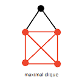

## I like computer science
for the same reason I like physics, for the same reason I like Math, and for the same reason I like sudokus or crossword puzzles. I like solving problems. Easy problems are fun, but even more fun are the hard ones. Some problems are so hard that they don't have a polynomial solution. And they are even so hard that no one can prove whether or not they should or shouldn't have one.

***

## NP-hard problems 
are notoriously difficult for classical computers because they lack a polynomial-time algorithm for a definitive solution. This means that as a problem grows in size, the time required to solve it explodes exponentially. While quantum computers aren't a silver bullet for these issues, **hybrid quantum-classical algorithms** are showing promise. These approaches combine the strengths of both computational paradigms to find faster, albeit heuristic, solutions.

***

## Traditional 
quantum optimization algorithms, such as the Quantum Approximate Optimization Algorithm (QAOA), scale linearly with a problem's size. However, recent research has introduced a new methodology that scales **logarithmically**. This is a monumental shift; it's the difference between needing hundreds of qubits for a problem versus just a handful.

Researchers tested this new algorithm on several NP-hard problems, including Maximum Cut, Minimum Partition, Maximum Weighted Independent Set, and **Maximum Clique**. They successfully ran experiments on both a quantum simulator (handling graphs with over 100 nodes) and a real quantum computer (up to 256 nodes). These results represent a significant leap, solving some of the largest realistic combinatorial optimization problems ever attempted on current noisy intermediate-scale quantum (NISQ) devices.

***

## The **P vs. NP problem**
is one of the most famous unsolved questions in computer science. Put simply, **P** problems are those that can be solved efficiently (in polynomial time) by a classical computer. **NP** problems, on the other hand, are problems where a solution can be quickly verified, but finding that solution is a monumental task. The prevailing belief among computer scientists is that P ≠ NP.

Quantum computers don't solve this fundamental question directly. Instead, they offer a new way to broach these difficult problems. By creating new algorithmic pathways, quantum computing can:

* Offer speedups for specific NP-hard problem heuristics.
* Dramatically reduce resource requirements, thanks to logarithmic scaling.
* Solve larger instances of problems than previously possible on existing hardware.

This means that while quantum computing may not be the key in proving P = NP, they add an intricate layer to the puzzle.

***

## The **Maximum Clique** 
problem is an excellent example of an NP-hard problem. A clique in a graph is a subset of vertices where every two distinct vertices are connected. The problem is to find the largest possible clique in a given graph.

Finding the maximum clique is computationally difficult because the number of possible groups to check grows exponentially with the number of vertices. This exponential explosion is exactly what makes the problem a perfect target for quantum optimization methods, as they can explore a vast number of possibilities simultaneously. For example, in this graph with 5 vertices, a **maximal clique** of size 4 would be the group of four vertices where every vertex in that group is connected to every other vertex in that same group. 

***

## The biggest challenge 
in quantum computing isn't just the algorithms; it's the qubits themselves. Current qubits are fragile, prone to errors, and have a very short **coherence time**. This makes building practical, large-scale quantum computers incredibly difficult.

However, a new generation of qubits is being developed to address these issues. For example, some researchers are exploring **topological qubits** based on Majorana zero modes. These qubits are theoretically more stable and less susceptible to **decoherence**, which could dramatically reduce the need for complex error correction.

When these hardware breakthroughs materialize, combined with advanced algorithms like the logarithmic-scaling method, we can expect to solve optimization problems and run simulations that are currently far out of reach. The future of quantum computing is not just about making marginal improvements—it's about a complete paradigm shift.

***

### Reference

Chatterjee, Yagnik; Bourreau, Eric; Rančić, Marko J. (2024). "Solving various NP-hard problems using exponentially fewer qubits on a quantum computer." *Physical Review A*, 109(5), 052441. https://doi.org/10.1103/PhysRevA.109.052441