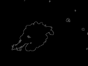
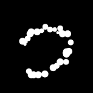

This portfolio presents my work from spring 2023 on the analysis of carbon nanoparticles. These materials are a subject of significant research due to their wide-ranging applications in fields like drug delivery, bioimaging, and energy storage. My project focused on addressing a key challenge in this research: the manual, time-consuming nature of analyzing microscopy images of these materials.

### The Project: Automation through Computer Vision

The core of my work involved developing an automated image processing workflow to characterize carbon nanoparticles. I used a methodology inspired by a study from Meng et al., which combined a **Hough Transform-based circle detection with Canny Edge detection**. This approach allowed for the determination of the average size of fused particles within an image.

My contribution to this methodology was its **successful application to images with a significantly higher degree of particle overlap**, a common and difficult problem in material science. This project demonstrates the practical application of computer vision and algorithmic analysis to streamline data characterization in material science research.

---

### Methods: A Recipe for Sizing a Raspberry Drupelet

Imagine you're trying to figure out the average size of the tiny droplets that make up a raspberry. You can't just measure them all by hand; that would take forever! My project tackled a similar problem, but with microscopic carbon nanoparticles instead of raspberry drupelets. Here's the recipe I developed to get the job done automatically.

**Step 1: Grayscale Conversion and Edge Detection**

First, the raw image is converted to a grayscale image. This simplifies the data, much like removing all colors from a photo to see the underlying shades of light and dark. Next, to find the edges of the particles, I applied an edge detection filter. After testing a few different methods, I found that the **Canny Edge detector** worked best. It uses a clever technique called **hysteresis thresholding** that’s especially good at finding the "soft edges" of these particles, filtering out noisy details while keeping the important ones. 

  
  

*Different edge maps for the same image produced by Canny Edge. The image on the right, which was optimized to omit complicated boundaries, was the one used for further analysis.*

**Step 2: Finding Circles with the Hough Transform**

Now that we have a clean outline, we need to find the circles. The **Hough Transform** is a powerful tool for this, as it's designed to find shapes like circles and lines in an image. It's like a voting system for pixels: each point on an edge "votes" for all the possible circles it could be a part of. The circles that get the most votes are the ones we detect.

  

**Step 3: Filtering with a Custom Mesh Method**

The Hough Transform sometimes finds circles that aren't quite right—like an inner and outer circle for the same particle. To solve this, I created a custom filtering method. I treated the original grayscale image as a mesh and evaluated each detected circle. If a circle didn't cover enough of the dark pixels (the particles themselves), it was thrown out. This step helped us keep only the circles that accurately represented the nanoparticles.

  

**Step 4: The Final Measurement**

Once the correct circles were isolated, I averaged their radii to determine the mean particle size. This final, quantitative measurement provides a clear, reproducible, and automated alternative to the traditional, time-consuming method of measuring particles by hand.