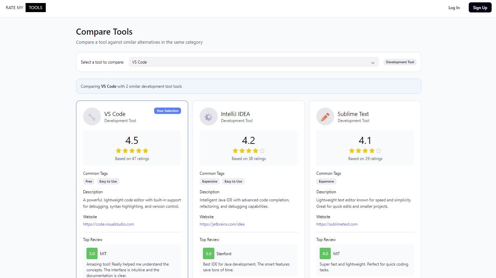

# RateMyTool(s)

## Project Overview
RateMyTool(s) is a community-driven review platform built to solve a specific problem at the University of Hawaii at Manoa: the fragmentation of educational resources. While students have access to thousands of AI tools, video tutorials, and practice platforms, there was no centralized way to validate which tools actually work for specific university courses.

Our solution acts as a "RateMyProfessor" for digital tools. It allows students to search for resources by course code (e.g., ICS 314), read peer reviews, and filter by category. The platform utilizes a modern Next.js stack with a PostgreSQL backend to ensure real-time data consistency and high performance.

---

## My Contributions

### 1. UI/UX Design & Prototyping
Before writing a single line of code, I led the high-level design process using Figma. I created high-fidelity mockups for every page in the application, establishing a "library-themed" visual identity that balances a clean, academic aesthetic with modern usability. This design phase was crucial for streamlining our development milestones, providing the team with a clear target for the frontend implementation.

### 2. Full-Stack Implementation: The Tool Page
My primary coding focus was the "Tool Page"—the core interface where users view details about a specific resource.
* **Frontend:** I implemented the dynamic routing and layout to display tool metadata, aggregate ratings, and associated course tags.
* **Backend Integration:** I handled the data fetching logic to ensure that when a user navigates to `/tool/[id]`, the page efficiently retrieves the tool's data, all associated student reviews, and a list of "Related Tools" based on category relationships.

### 3. AI-Powered Content Moderation
One of the project's most technically complex features was the automated moderation system. I integrated the **OpenAI API** to sanitize user-generated content in real-time.
* **Schema Modification:** I modified the Prisma schema for our NeonDB database to include a review status workflow. Reviews are flagged as `pending`, `approved`, or `denied`.
* **The Logic:** When a user submits a review, it is passed through OpenAI's `omni-moderation-latest` model. The system analyzes the text for hate speech or harassment and automatically updates the status in the database, ensuring a safe community environment without requiring constant manual oversight.

### 4. Quality Assurance & DevOps
Beyond feature development, I played a key role in maintaining the health of the codebase.
* **Database Management:** I assisted in troubleshooting the seeding process for NeonDB to ensure our development environment had consistent test data.
* **Deployment:** I helped resolve configuration issues with Vercel to ensure smooth continuous deployment.
* **Code Review:** I identified and fixed critical bugs, such as duplicate API imports that were causing page crashes during the build process.

---

## Team & Process
This project followed an Issue Driven Project Management (IDPM) methodology. Working with a team of five was a valuable exercise in communication and efficient task distribution. We utilized GitHub Projects to track milestones (M1, M2, M3), manage merge conflicts, and ensure that our "divide and conquer" strategy resulted in a cohesive final product. A special thanks to my team members Joseph Creollo, Justin Iwata, Kade Komeya, and Chase Tom. Their support and ingenuity on this project cannot be overstated.
